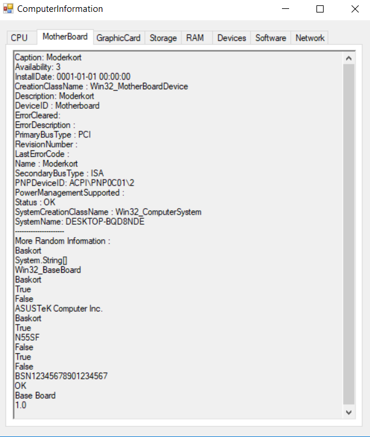

# Computer Information

While debugging and solving computer related issues it is common to require information about the problematic device. Much of the information can be gathered using functions such as dxdiag, msconfig and poolmonish. This Windows Form application utilizes these functions to gather data about the system and present them in one place.Showing information about your system in different tabs. See image below for demonstration.

# How to execute
Either download the release `.exe` file from github and run it, or download/clone this project and build the project by opening the `.sln` project file in Visual Studio.

# Requirements
This program is a Windows Form, and constructed to work on Windows exclusively.

# Testing
TODO:

TODO: Release Assets
# License
This project is created under a [MIT LICENSE](./LICENSE).

Copyright (c) Grebtsew